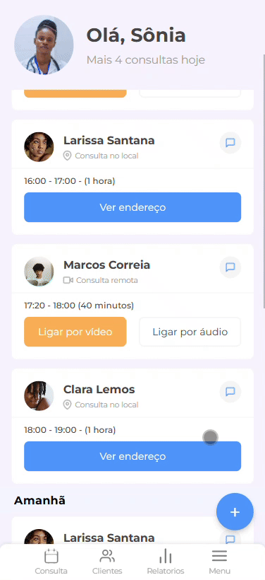

# Desafio #7DaysOfCode - Aula

## Sobre o Desafio

Este repositório contém o resultado do **Desafio #7DaysOfCode** da minha jornada de aprendizado no desenvolvimento web. O objetivo foi construir uma página web responsiva, aplicando vários conceitos e boas práticas que foram abordados na aula. A ideia era transformar um layout do Figma em código, com foco em design responsivo e desenvolvimento mobile-first.

## Tecnologias Utilizadas

- **HTML5**: Para estruturação do conteúdo da página.
- **CSS3**: Para estilização, com ênfase em responsividade.
- **Flexbox**: Para construção do layout de forma eficiente e adaptável.
- **Media Queries**: Para garantir que a página seja responsiva e funcione bem em diferentes tamanhos de tela.
- **Botões flutuantes**

